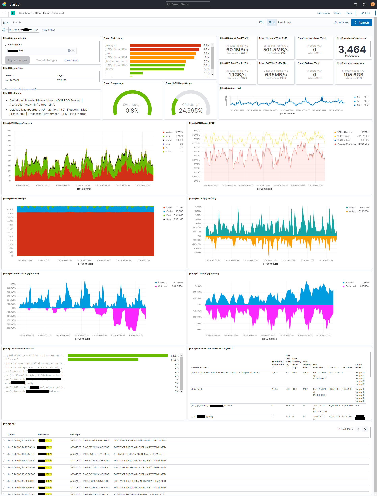

# "Metraixbeat" daemon description:

### Main Dashboard screenshot

### Major update done in January 2021 !
    Metraixbeat has been improved and tested with ELK 7.10.1
	Please find main improvements
	* JSON: Labels and Tags added
	* Filebeat: Multiline separator (JAVA stack by example) and more dynamic conversions in Target File name implemented
	* AIX: Error logs (errpt) plugin that sends each alerts to Filebeat index
	* Network: Bulking messages, different output for Metricbeat, Filebeat and Logstash
	* Tested on AIX 5.3, 6.1, 7.1 and 7.2
	* Bug corrections and AIX/Linux/Windows harmonization for common dashboards (ECS standards)
	

### Command line to execute (as root)
	Usage:
	metraixbeat -c <Parameters.conf file path> -l <Logs directory path>
	
	My config:
	/opt/bin/python3 /opt/freeware/sbin/metraixbeat -c /etc/metraixbeat/Parameters.conf -l /var/adm/ras/metraixbeat/

### Tried to make the same than "metricbeat" LINUX daemon 
    * But basically, can work with all JSON receiver :-)
	* Working without modifications to ELK stack
 	* Respect of ECS standards
 	* Possible to specify multiple Elastic servers for Load Balance + Queueing in case of full failure
	* Performance of the daemon is overall good without much impact on system but sample rate is (by default) lower than LINUX metricbeat
    * Filebeat like plugins and custom script results easy integration

### Fully based on Python3 
	Tested only with 3.7 and 3.8 but should work with other Python3 versions
	Compatible with AIX 5.3/6.1/7.1/7.2 ( that's to say Python 3.x is installed)
	Only 2 dependencies to install from PIP before using it
		requests for handling easily and properly TCP requests
                "/opt/bin/python3 -m pip install requests"
		pingparsing to use the "Ping Plotter" plugin
                "/opt/bin/python3 -m pip install 'pingparsing<1.0.0' "

### Few minutes for tuning Parameter.conf file and the daemon is ready to go
	See project readme file for all parameters that can be adjusted in "Parameters.conf" file
	
	
### Adding more metrics for AIX for fine monitoring ! (See project dashboards screenshot folder)
	Added new metricset from "hpmstat"  command (smt mode usage, CPU cache reload and affinity, etc...)
	Added new metricset from "lparstat" command (monitoring hypervisor work on key metrics)
	Added metrics for hypervisor, memory and CPU (A lot...)
	
	
### Developped common AIX/LINUX/WINDOWS and AIX specific Infrastructure Dashboards
    Will provide "Capacity Planing" and "Hot Points" Dashboards soon 
  
  
### Added some filebeat functionality inside this metraixbeat daemon
	Tailing a file and catch events depending of specified patterns
	Each Target File and matching patterns can be configured inside a simple JSON file with REGEX (see readme files)
	Target File sanity is checked in many way (by inode, size, name, etc ...)
	Implemented mutliline separator for huge log stack like JAVA
	Implemented different outputs for logs (Elasticsearch or Logstash)
  
  
### Added functionality to send the result of SH script directly into ELK
	Each executed script and sample rate can be configured inside a simple JSON file (see readme files)
  
  
### Things that are not tunable for now and/or need rework
	ELK Version
		This development is based on ELK 7.70.1. It should work with lower version if you use Custom Dashboards furnished in this project
	Index names
		You can configure a part of the metricbeat and filebeat index but naming convention hardly coded
		"ex: 'metricbeat' will create metricbeat-7.10.1" (ELK 7.10.1 is this current Metraixbeat version)
	system.socket metricset can be generated but take a lot of CPU resources
		This metricset requires too much CPU to be generated. I disable it by scheduling it very high in "Parameters.conf" by default... Need rework !
